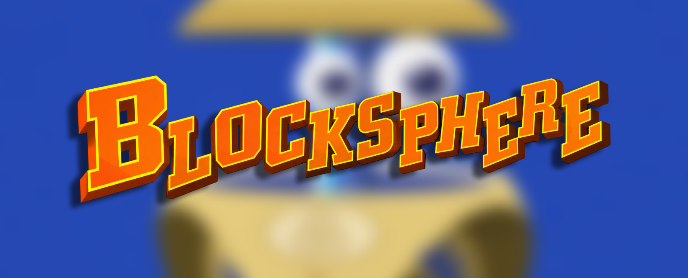

<p align="center">
  
</p>

> This project was created with AI assistance. If that's not your cup of tea, feel free to move along.

# Blocksphere

A Nintendo 64 Tetrisphere recompilation.

A community PC port of **Tetrisphere** for Linux and Windows x86-64, built through static recompilation with N64Recomp, N64ModernRuntime, RSPRecomp, and RT64.

This is an independent fan project, with no affiliation with or endorsement from the original developers, publisher, or rights holders.

## Why I built this

I started Blocksphere to better understand how video games are developed and to grow my (limited) skills as a programmer. Working with a game I enjoy gives that learning a concrete purpose: understanding how its code was developed, how its rendering, audio, input, and platform services fit together, and what it takes to bring them to a modern PC.

I set the project's direction, define its requirements, choose priorities, and make the decisions about what is ready and what needs more work. My hands-on playtesting, visual comparisons, listening tests, and feedback have driven repeated fixes to widescreen presentation, audio, controls, and usability. I also contributed code reviews and ideas for implementation.

AI is one of the tools I use throughout this process. The goal is to learn through investigation, experimentation, and iteration, and to build something I can understand and keep improving.

**Blocksphere 1.0 has been released.** Download it from [GitHub Releases](https://github.com/djultra64/Blocksphere/releases/latest). I will keep working on Blocksphere, improving compatibility, fixing bugs, and refining the experience. Bug reports are welcome through [GitHub Issues](https://github.com/djultra64/Blocksphere/issues).

Native Linux and Windows builds exist, with hands-on review of representative game modes, audio, widescreen fixes, and local two-player play. Physical 4K output, high-refresh presentation, extended stability, and the full controller/device matrix are not fully verified.

## Features

- Native executables for Linux and Windows x86-64, with RT64 rendering and recompiled RSP audio.
- Original gameplay and modes, including Rescue, Hide & Seek, Puzzle, Time Trial, Training, and VS, with local two-player support.
- 4:3 and 16:9 presentation, with game-specific HUD, pause-image, and framebuffer fixes.
- Saved graphics settings: resolution, aspect ratio, window mode, refresh request, MSAA, presentation filtering, and texture filtering.
- Keyboard and controller input, persistent remapping by action, and prompts that follow the last active input device.
- One-time import of a supported ROM, with settings and progress stored locally.

Further testing is required on several modes and configurations.

## Requirements

- Linux or Windows on an x86-64 PC.
- Your own **Tetrisphere US NTPE revision 0** ROM. Other regions, revisions, and modified ROMs are not supported.

No ROM, extracted original game assets, save files, screenshots, or captured audio are distributed with this project. Do not submit those files in issues or pull requests.

## Getting started

1. Extract the entire package and keep its folders and runtime libraries together.
2. Run `./tetrisphere` on Linux or `tetrisphere.exe` on Windows.
3. Select your supported ROM when prompted. The beta can also discover a matching ROM beside the executable or accept its path as the last command-line argument. Supported input formats are `.z64`, `.v64`, `.n64`, and `.zip`.
4. Keep the `data/` folder beside the game executable when updating; it contains the imported ROM, settings, progress, and diagnostics. Move or copy the whole game folder to carry your data with you. Older betas stored data in your user profile; to keep that progress, copy the old data directory's contents into the new game's `data/` folder before launching.

Open `./tetrisphere-config` on Linux or `tetrisphere-config.exe` on Windows, beside the game executable, to change persistent graphics settings. Each selection saves immediately; restart the game to apply settings that cannot change during play. Run the game's `--help` for options that apply to one launch.

| Shortcut | Action |
| --- | --- |
| F11 or Alt+Enter | Toggle fullscreen |
| F1 | Open or close the RT64 inspector |

The inspector exposes safe live filtering controls. Its changes apply to the current session; use the settings utility for persistent preferences.

## Controls

Actions are mapped to **physical button positions**, and displayed labels follow the last active device. Nintendo Switch swaps the A/B and X/Y names relative to Xbox at the same positions.

| Action | Xbox | PlayStation | Nintendo Switch | Keyboard |
| --- | --- | --- | --- | --- |
| Move / navigate | Left stick or D-pad | Left stick or D-pad | Left stick or D-pad | Arrow keys |
| Confirm / drop | A (south) | Cross (south) | B (south) | Z |
| Cancel / slide | B (east) | Circle (east) | A (east) | X |
| Magic | X (west) | Square (west) | Y (west) | A |
| Original C-up input | Y (north) | Triangle (north) | X (north) | I |
| Start / pause | Menu / Start | Options | + | Enter |

Saved remapping overrides these defaults. If automatic detection is ambiguous, the settings utility offers a manual family selection: `family xbox`, `family playstation`, `family nintendo-switch`, or `family keyboard`; `family auto` restores detection. Two-player play requires independent input devices. Prompt correctness and physical actions must be checked together on each supported controller family; the full hands-on matrix remains pending.

## Development

Dependency revisions are recorded in [the dependency lock](config/dependencies-m1.json). The [Linux](docs/qa/m1-linux-protocol.md) and [Windows](docs/qa/m1-windows-protocol.md) protocols document the initial reproducible toolchain and prototype; they are historical M1 instructions, not a complete build guide for the latest beta.

These initial checks do not build the game:

```sh
python3 tools/build/fetch_dependencies.py --json
python3 tools/build/check_environment.py --json
python3 tools/rom/validate.py /path/to/Tetrisphere.zip
```

Original ROM data and generated game code remain private. See [release source and build prerequisites](docs/RELEASE_SOURCE.md) for the source bundle, pinned dependencies, and required private inputs.

## Faced challenges

The areas that required the most investigation and repeated validation were:

- **Recompilation and runtime compatibility.** Establishing the code map, indirect call targets, game overlays, OS services, and graphics/audio microcodes took substantial work before the native prototype could run reliably. Generated code had to remain reproducible rather than being patched by hand.
- **Audio timing.** Producing PCM was only the first step. Queue feedback and DMA pacing caused dropped audio blocks and crackling, requiring runtime changes, timing models, and listening tests on real systems.
- **Widescreen HUD and transitions.** The game rebuilds its rendering layers during scoring, heart loss, pause, and results. Early fixes based on projection order missed those paths. Tracing the original UI producers and carrying their identity through buffered draw calls took several iterations, alongside fixes for pause captures and the Puzzle framebuffer's lower rows.
- **Device-correct prompts.** Xbox, PlayStation, Switch, and keyboard prompts had to match actual actions and remaps. Original font textures also used narrower visible character widths than their storage cells, clipping replacement glyphs until the layout accounted for the game's drawing bounds.
- **Packaging and cross-platform validation.** Native Windows builds, Linux runtime libraries, ROM import, paths with spaces, saved settings, and package provenance needed separate checks. Automated rendering tests could not replace hands-on review of image quality, audible sound, fullscreen behavior, or physical controllers.

## AI Disclosure

I use **OpenAI Codex** to assist with research, reverse-engineering analysis, code implementation, debugging, tests, builds, packaging, and documentation. I direct that work, contribute code reviews and ideas for implementation, evaluate the game's behavior through hands-on testing, and decide which changes and releases to accept. Validation claims remain limited to the recorded builds and scenarios.

The original game and the upstream tools remain the work of their respective creators, credited below.

## Credits and attribution

### Original game

**Tetrisphere** was developed by **H2O Entertainment** and published by **Nintendo**. Its soundtrack was composed and produced by **Neil D. Voss**. Credit also belongs to the complete original design, programming, art, production, testing, localization, and special-thanks teams, as credited in the game. See [the original Nintendo 64 credits](https://www.mobygames.com/game/3761/tetrisphere/credits/n64/) for the complete roster.

All original game material and associated names and trademarks remain with their respective rights holders. This port does not claim authorship of that material.

### Recompilation, runtime, rendering, and analysis

| Project | Attribution and role |
| --- | --- |
| [N64Recomp / RSPRecomp](https://github.com/N64Recomp/N64Recomp) | Wiseguy and contributors; static CPU and RSP recompilation. MIT. |
| [N64ModernRuntime](https://github.com/N64Recomp/N64ModernRuntime) | N64Recomp runtime authors and contributors; host services for recompiled games. Includes GPLv3-licensed code. |
| [RT64](https://github.com/rt64/rt64) | RT64 contributors; graphics rendering and inspection. MIT. |
| [splat](https://github.com/ethteck/splat) | Ethan Roseman and contributors; binary analysis tooling. MIT. |
| [spimdisasm](https://github.com/Decompollaborate/spimdisasm) | Decompollaborate and contributors; MIPS disassembly tooling. MIT. |
| [Microsoft DirectX Shader Compiler](https://github.com/microsoft/DirectXShaderCompiler) | Microsoft, LLVM/Clang authors, and contributors; shader tooling, including Windows `dxcompiler.dll` and `dxil.dll`. See its [license and component notices](https://github.com/microsoft/DirectXShaderCompiler/blob/main/LICENSE.TXT). |

### Supporting libraries and upstream components

Credit extends to all authors and contributors of the following components recorded in the dependency/license inventory, including platform-specific, tooling, and sample dependencies. Listing a component here does not mean every platform links or ships it.

- **ELFIO** — Serge Lamikhov-Center; **{fmt}** — Victor Zverovich and contributors; **Rabbitizer** — Decompollaborate; **SLJIT** — Zoltan Herczeg; **toml++** — Mark Gillard.
- **miniz** — Rich Geldreich, Tenacious Software, RAD Game Tools, Valve Software, and contributors; **o1heap** — Pavel Kirienko; **xxHash** — Yann Collet and contributors; **Zstandard** — Meta Platforms and contributors.
- **SDL2 / SDL2_net** — Sam Lantinga and contributors; **nlohmann/json** — Niels Lohmann and contributors.
- **ddspp / hlsl++** — Emilio López and contributors; **Im3d** — John Chapman; **Dear ImGui** — Omar Cornut and contributors; **ImPlot** — Evan Pezent and contributors; **GLFW** — Marcus Geelnard, Camilla Löwy, and contributors.
- **Native File Dialog Extended** and its upstream authors/contributors; **plume / re-spirv** — renderbag and contributors; **stb** — Sean Barrett and contributors.
- **Vulkan Headers / SPIR-V Headers / SPIRV-Cross** — Khronos and contributors; **Vulkan Memory Allocator / D3D12 Memory Allocator** — AMD and contributors; **volk** — Arseny Kapoulkine and contributors; **metal-cpp** — Apple.
- **Mupen64Plus**, its API authors, and contributors; **GNU awk**, the Free Software Foundation, and contributors; **NASM** authors; and the authors of the additional build scripts and sample code retained in upstream notices.

The [full-text notice inventory](THIRD_PARTY_NOTICES.md) preserves the collected license texts and copyright notices, including additional named contributors. This source inventory includes research-only dependencies. Binary-specific notices must be matched to exact artifacts before a binary release.

### Research and reference tools

- [RecompFrontend](https://github.com/N64Recomp/RecompFrontend), including its **RmlUi**, **lunasvg / plutovg**, **FreeType**, and **GamepadMotionHelpers** dependencies — frontend research candidates; this credit does not claim that their code or assets are shipped in the current port.
- [ares](https://github.com/ares-emulator/ares) and its contributors — emulated reference, using v148; [Ghidra](https://github.com/NationalSecurityAgency/ghidra) and its contributors — reverse-engineering tooling.
- [Chris Gilmore's n64tetristools](https://github.com/chris-gilmore/n64tetristools) and [dcm2xm](https://github.com/chris-gilmore/dcm2xm) — format and music research references. The initial audit did not establish permission to reuse their code or resources.
- [M. Stoler's 1997 guide](https://gamefaqs.gamespot.com/n64/198946-tetrisphere/faqs/3332) and [the transcribed Australian manual](https://www.world-of-nintendo.com/manuals/nintendo_64/tetrisphere.shtml) — mode and progression references, checked against the supported US revision.
- **QEMU / qemu-irix** authors and contributors — exploratory toolchain research; and the **Python, CMake, Ninja, GCC, LLVM/Clang, MSVC, Git, and Flatpak** communities and vendors — development and build tooling.

Thanks to the broader N64 recompilation, emulation, and preservation communities, and to everyone whose research and tooling made this project possible.

## Licensing and distribution

Each upstream component retains its own license and copyright notices. A credit in this README does not replace the full license text or any corresponding-source obligations. Newly authored Blocksphere code is licensed under **GPL-3.0-or-later**; see [LICENSE](LICENSE). Upstream code remains subject to its existing licenses. The code license does not cover original game material or branding images. The original game material is outside any license granted for the port's original work.

Release packages include the applicable upstream notices and the port license. Source and pinned dependency materials accompany the release. The Windows package includes the DXC compiler and DXIL signing libraries with their release-specific license terms.

## Reporting issues

Include the package version or build identifier, operating system, GPU and driver, game mode, input device/family, relevant settings, and steps to reproduce. Describe the expected and observed behavior. Remove usernames, private paths, and credentials from diagnostic output, and do not attach ROMs, extracted assets, saves, or captured game media.
